# Tutorial Passo a Passo

Este tutorial guia você através de todos os passos necessários para provisionar a infraestrutura na AWS e fazer o deploy da aplicação web.

---

## Fase 1: Provisionamento com Terraform

Execute os comandos abaixo no diretório **`terraform/`**:

```bash
cd terraform/
```

---

### 1. Inicializar o Terraform

Inicialize o Terraform e faça o download do provider AWS:

```bash
terraform init
```

**O que acontece:**
- Download e instalação do provider AWS
- Criação do diretório `.terraform/` com os plugins
- Inicialização do backend para armazenar o estado
- Preparação do ambiente para execução

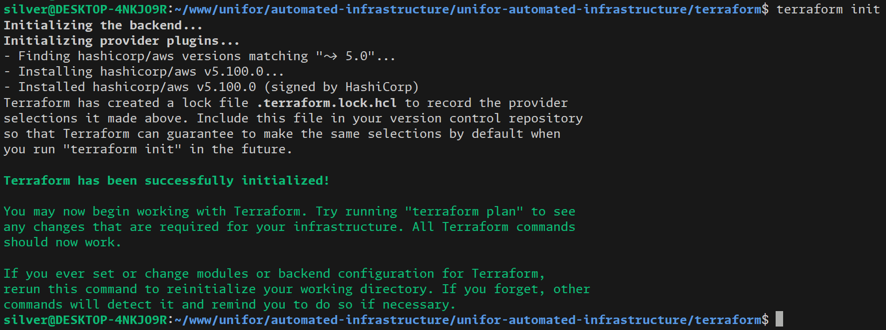

---

### 2. Validar a Configuração

Valide a sintaxe e estrutura dos arquivos Terraform:

```bash
terraform validate
```

**O que é verificado:**
- Sintaxe dos arquivos `.tf`
- Referências a recursos e variáveis
- Estrutura e formato das configurações
- Compatibilidade entre recursos

**Resultado esperado:** `Success! The configuration is valid.`

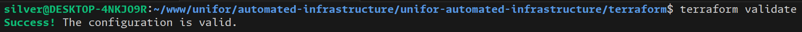

---

### 3. Visualizar o Plano de Execução

Gere um plano detalhado mostrando todos os recursos que serão criados:

```bash
terraform plan
```

**Recursos que serão criados:**
- VPC, Subnet, Internet Gateway
- Security Groups
- Instância EC2
- Key Pair

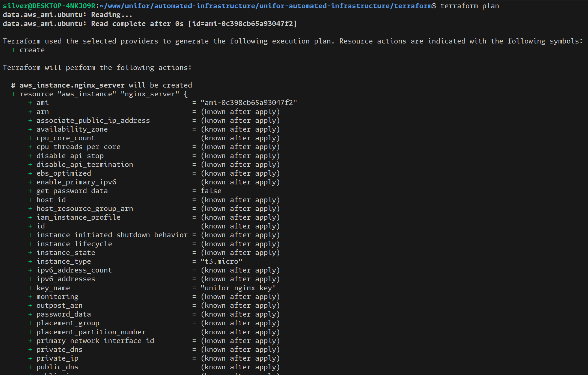
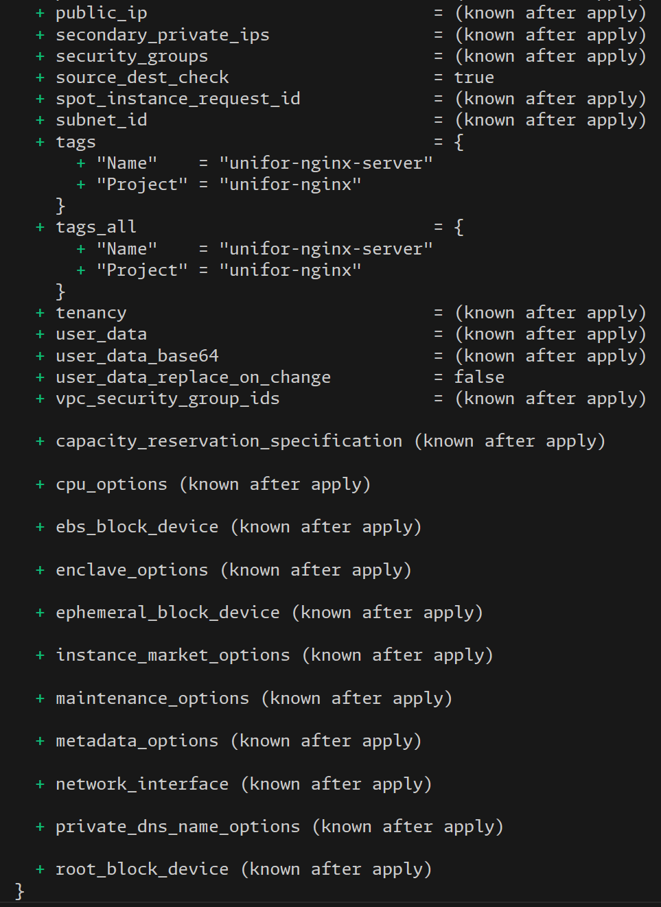
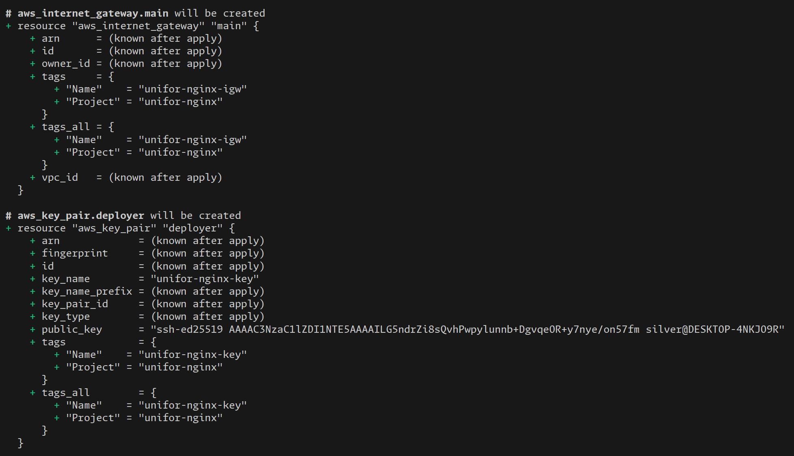
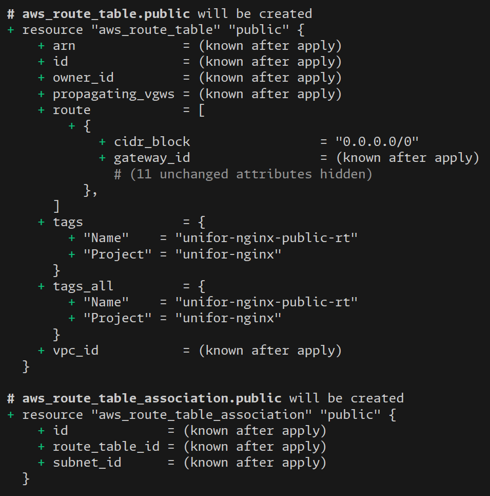
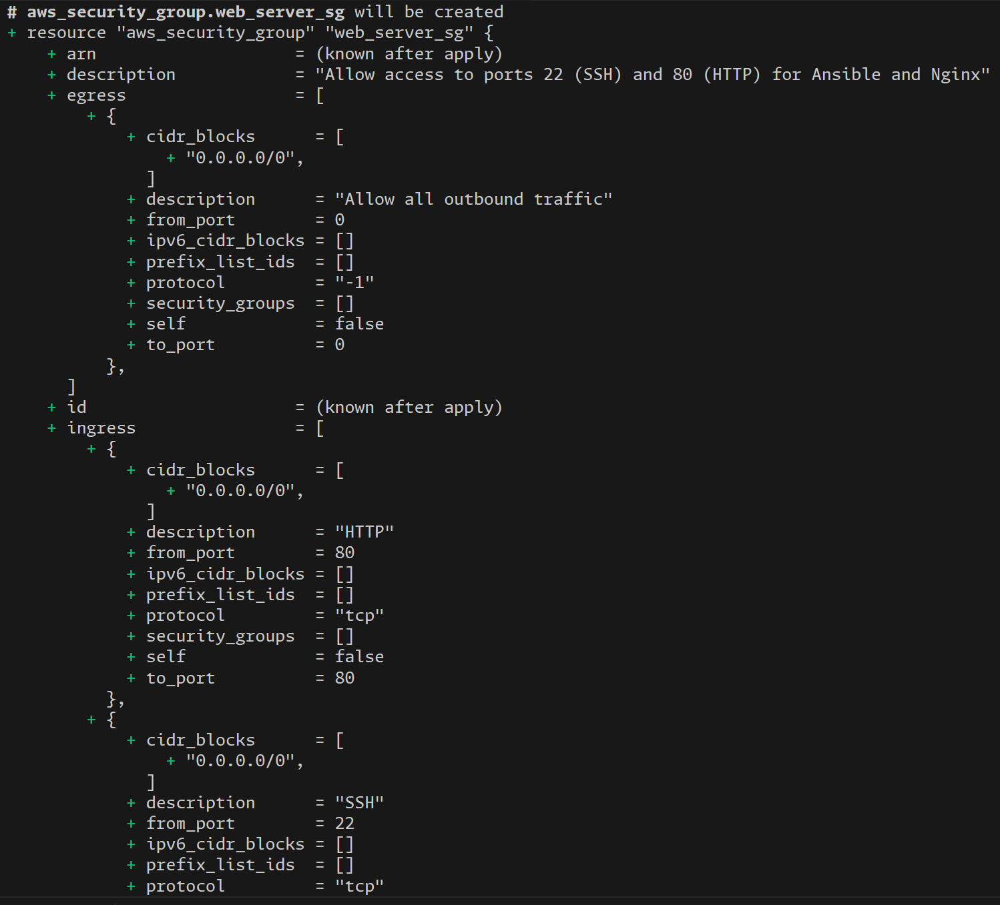
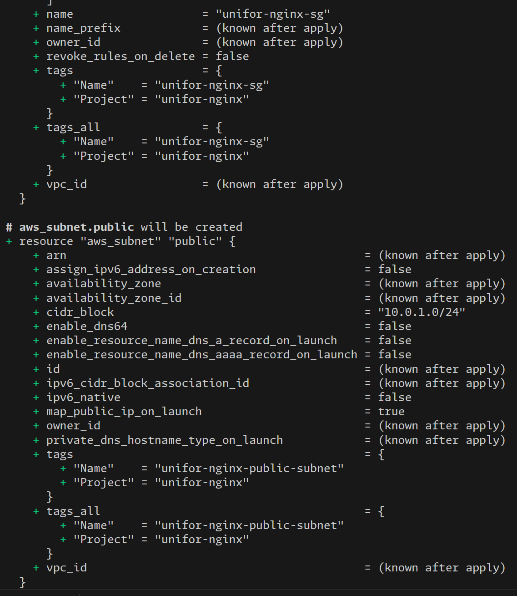
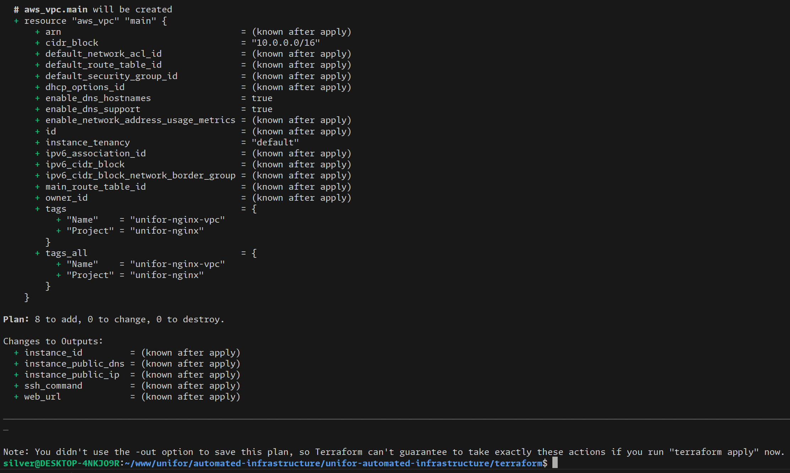

---

### 4. Aplicar a Infraestrutura

Crie efetivamente toda a infraestrutura na AWS:

```bash
terraform apply
```

**Ação necessária:** Digite `yes` quando solicitado para confirmar.


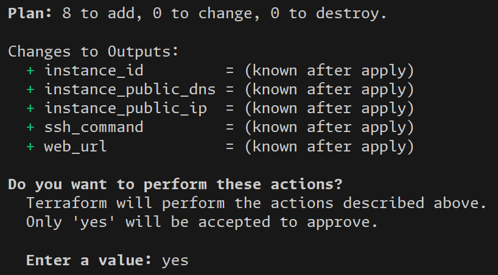
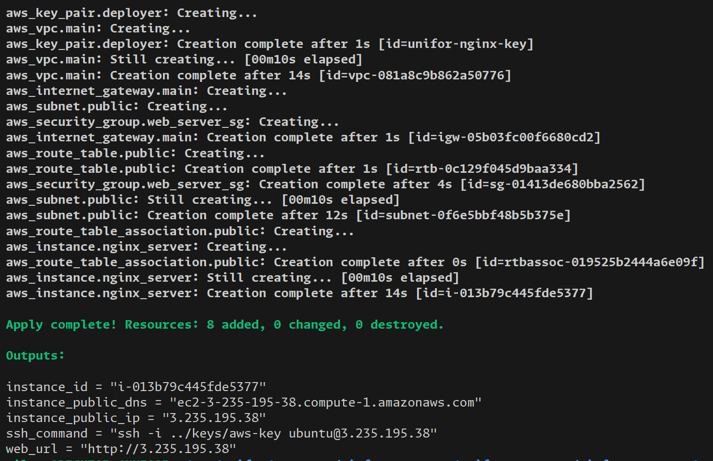

---

### 5. Obter Informações da Infraestrutura

Exiba informações importantes sobre os recursos criados:

```bash
terraform output
```

**Outputs disponíveis:**
- IP público da instância
- DNS público
- Comando SSH pronto para uso
- URL do site

**Importante:** Copie o **IP público** para usar no próximo passo.

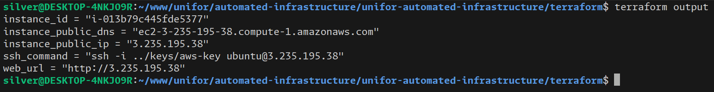

---

## Fase 2: Configuração com Ansible

Execute os comandos abaixo no diretório **`ansible/`**:

```bash
cd ../ansible/
```

---

### 6. Atualizar o Inventário

Edite o arquivo `ansible/inventory.ini` e substitua `<YOUR_EC2_PUBLIC_IP>` pelo IP público obtido no passo anterior:

```ini
[webserver]
<SEU_IP_PUBLICO> ansible_user=ubuntu ansible_ssh_private_key_file=../keys/aws-key
```

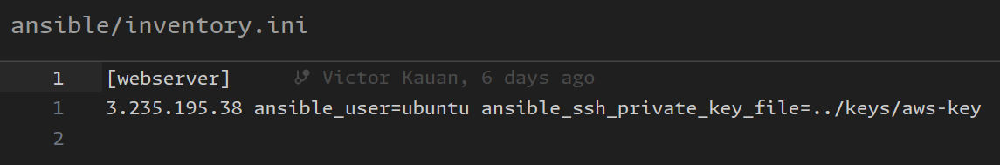

---

### 7. Executar o Playbook

Execute o playbook para configurar o servidor e fazer o deploy:

```bash
ansible-playbook playbook.yml
```

**O que será executado:**
- Atualização de todos os pacotes do sistema
- Instalação do Nginx
- Deploy da página web customizada
- Configuração de permissões

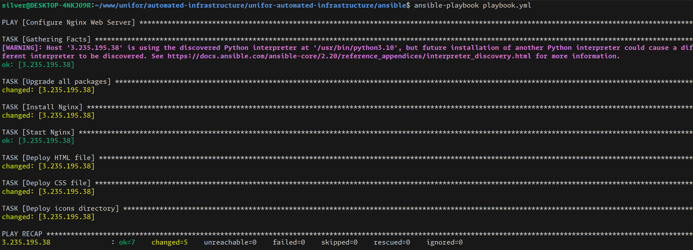

---

## Fase 3: Verificação

### 8. Verificar os Recursos Criados

**Console AWS:**

Acesse o console da AWS e verifique que a instância está rodando:

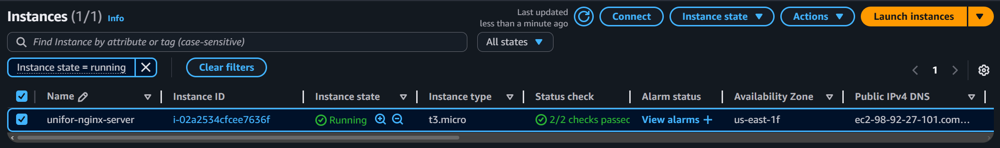

**Acessar a Aplicação:**

Abra o navegador e acesse:

```
http://<IP_PUBLICO_DA_INSTANCIA>
```

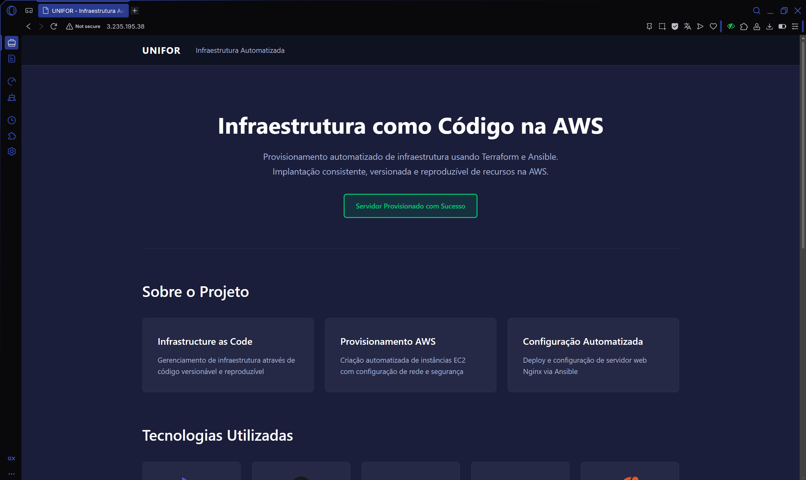

---

## Limpeza: Destruir a Infraestrutura

Quando terminar, remova todos os recursos para evitar custos.

Execute no diretório **`terraform/`**:

```bash
cd ../terraform/
terraform destroy
```

**Ação necessária:** Digite `yes` quando solicitado para confirmar a destruição.

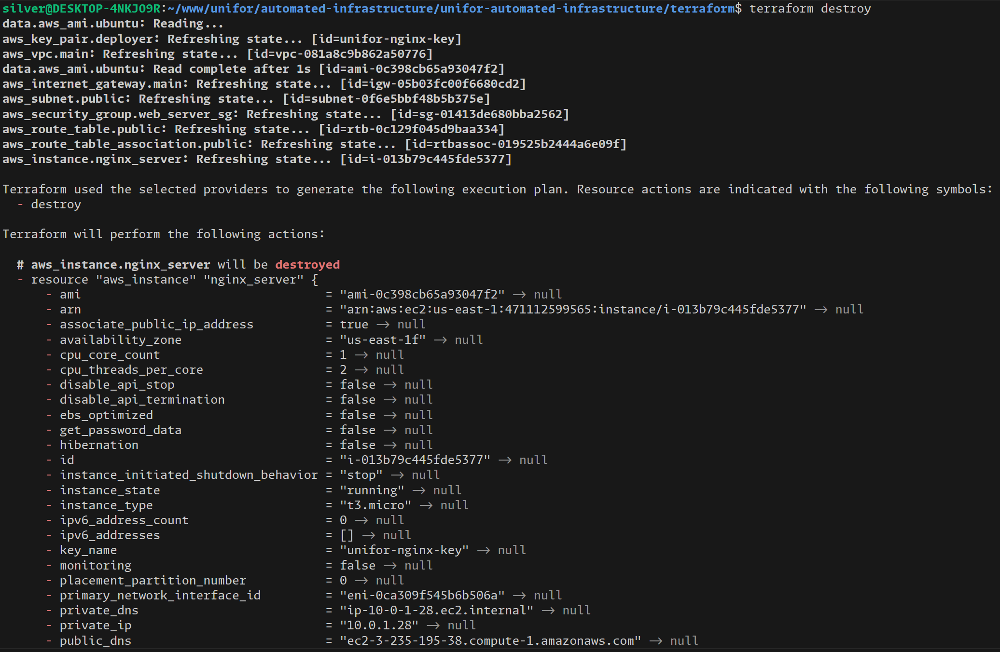
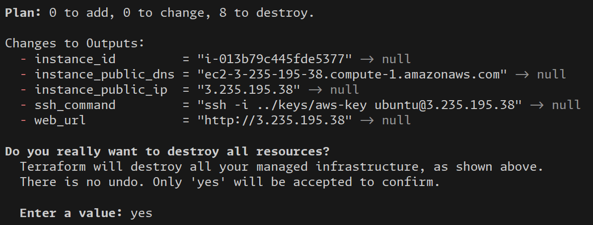
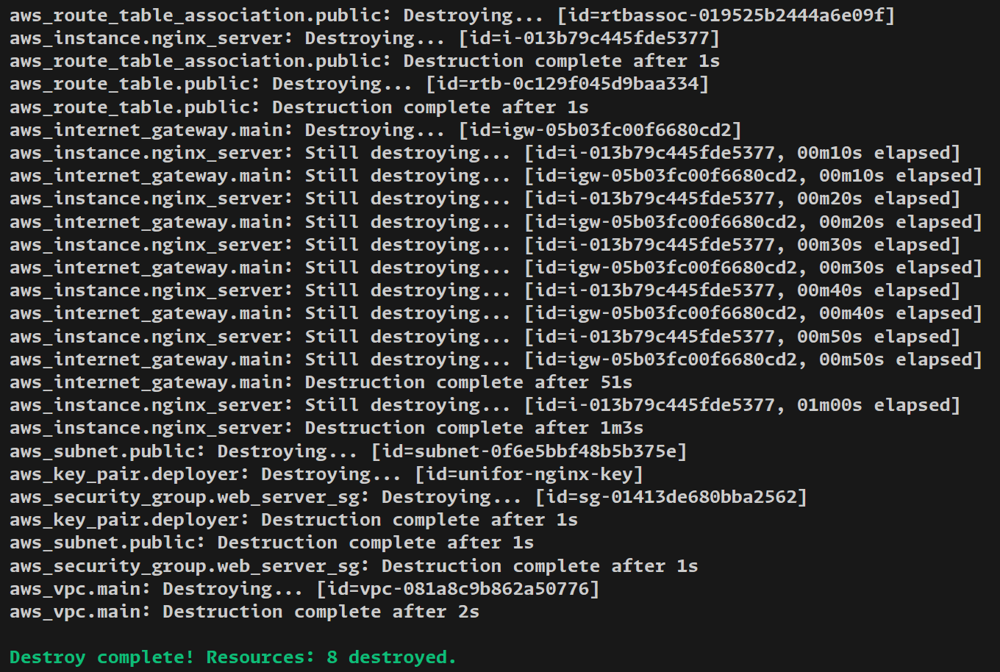

---

## Resumo dos Comandos

```bash
# 1. Terraform
cd terraform/
terraform init
terraform validate
terraform plan
terraform apply
terraform output

# 2. Ansible (editar inventory.ini primeiro)
cd ../ansible/
ansible-playbook playbook.yml

# 3. Limpeza
cd ../terraform/
terraform destroy
```
